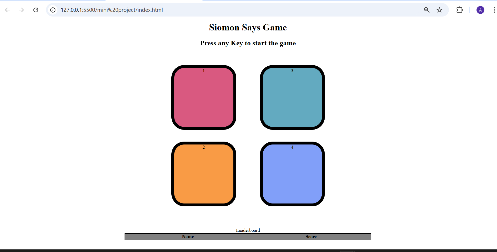

# 🎮 Simon Says Game

A fun and interactive **Simon Says** memory game built using **HTML**, **CSS**, and **JavaScript**.  
Test your memory skills by repeating the color sequence shown by the game. Each level gets harder as the sequence grows!  

## 📷 Screenshot

1. Press any key to start the game.
2. Watch the color sequence carefully.
3. Click the buttons in the exact same order.
4. If you click the wrong button, the game ends and your score is shown.
5. Try to beat your highest score and get to the top of the leaderboard!

## 🛠 Technologies Used
- HTML5
- CSS3
- JavaScript (Vanilla JS)

## 📜 License
This project is open source and free to use.

## 📬 Author
**Anshika Shukla**  
💻 GitHub: [Anshika-shukla-03](https://github.com/Anshika-shukla-03)  
